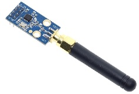

# RTS
This project provide code to emulate an RTS remote (used by Somfy cover).  It can send RTS frame (emulate remotes) and also receive those frames and then simulate the cover moves to get a pretty accurate feedback.  This allow to keep in sync the cover status by using at the same time real hardware remotes and simulated one without messing the rolling codes.

MQTT interface allow to easily interface with domotic solution like Home Assistant.

You can record your real hardware remote (40 memory slots for remotes) and link them to the virtual covers (10 slots).  Finaly define additionnal 'soft' remote and link them to the covers as well (a virtual cover can be linked to 10 remote slots).  This allow to control the cover using either the hardware and the software remotes (throught MQTT and Home Assistant for instance) without messing with the rolling codes and get a status of the cover.  As the RTS protocol does not feedback the cover position, this is emulated by software and should kept in sync provided that the reception area is good and that the cover speed has be correctly define (time for full open to full close).

Data are stored on ESP flash to keep definition and rolling codes when power lost.

RX/TX are done usign OOK modulation at 433.42 MHz.  This is slightly different that usual 433 transmitter.  For best coverage and good signal, it's important to use the correct frequency, so a CC1101 module with external antenna is used.

| WeMOS D1 mini PIN (ESP8266 PIN) | CC1101 PIN (8 PIN Header) | (10 PIN Header) | LED |
| --- | --- | --- | --- |
| GND | GND (1) | (9 + 10) ||
| 3V3 | VCC (2) | (1 + 2) ||
| D1 (GPIO5) | GDO0 IN (3) | (8) ||
| D8  (GPIO15) | CSN (4) | (7) ||
| D5 (GPIO14/SCK) | SCK (5) | (4) ||
| D7 (GPIO13/MOSI) | MOSI (6) | (3) ||
| D6 (GPIO12/MISO) | MISO (7) | (5) ||
| D2 (GPIO4) | GDO2 OUT (8) | (6) ||
| D3 (GPIO0) | --- | --- | 330R + Green LED to 3V3 |
| D4 (GPIO2) | --- | --- | 330R + Red LED to 3V3 |

Credit:This project has be done by reverse engineering some real frame generated with real hardware remote and also by some informations found on the Internet about the RTS protocol.

More the protocol itself is already provided at https://pushstack.wordpress.com/somfy-rts-protocol/ and at https://github.com/henrythasler/sdr/tree/master/somfy so I'll not explain more here.  It seems that there is 2 versions, one based on 56 bits frame wich I have device to test and wich is working very well here.  A second version with 80 bits frame seems to exist but I don't have any device to test, so the 80 bit code is based on information found on the web but not tested on real hardware.  If you have those feel free to contact me.
